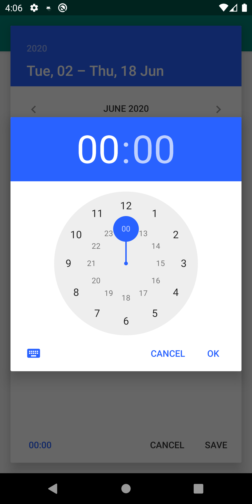

# Calendar Veiw
[](https://android-arsenal.com/api?level=16)
[](https://jitpack.io/#danielvilha/calendarview)

A calendar that allows you to select both a single date and a period. Calendar allows you to change colors programmatically without reference to the theme.
Sample 01 | Sample 02 | Sample 03 | Sample 04
--- | --- | --- | ---
 |  |  | 

## Installation
Step 1. Add the JitPack repository to your build file
```groovy
allprojects {
  repositories {
    ...
    maven { url 'https://www.jitpack.io' }
  }
}
```

Step 2. Add the dependency
```groovy
dependencies {
  implementation 'com.github.danielvilha:calendar-view:${version}'
}
```

## Usage
1. Add `MaterialCalendarView` into your layouts or view hierarchy.

```xml
<com.danielvilha.calendarveiw.CalendarView
        android:id="@+id/calendarView"
        android:layout_width="match_parent"
        android:layout_height="match_parent" />
```

Or show calendar as dialog:
```kotlin
CalendarDialog()
    .setSingle(false)
    ?.setFirstMonday(false)
    ?.setCallback(this@MainActivity)
    ?.show(supportFragmentManager, "TAG")
```

```java
new CalendarDialog()
        .setSingle(false)
        .setCallback(listener)
        .show(getSupportFragmentManager(), "TAG");
```

2. Set a `CalendarDialog.Callback` when you need it
```kotlin
class MainActivity : AppCompatActivity(), CalendarDialog.Callback {
    ...

    override fun onCancelled() {
        Toast.makeText(this, "Cancelled", Toast.LENGTH_LONG).show()
    }

    override fun onDataSelected(firstDate: Calendar?, secondDate: Calendar?, hours: Int, minutes: Int) {
        if (firstDate != null) {
            if (secondDate == null) {
                firstDate[Calendar.HOUR_OF_DAY] = hours
                firstDate[Calendar.MINUTE] = minutes
                Snackbar.make(
                    findViewById(R.id.btnShowCalendar),
                    SimpleDateFormat(getString(R.string.timeFormat), Locale.getDefault()).format(firstDate.time),
                    Snackbar.LENGTH_LONG
                ).show()
            } else {
                secondDate[Calendar.HOUR_OF_DAY] = hours
                secondDate[Calendar.MINUTE] = minutes
                Snackbar.make(
                    findViewById(R.id.btnShowCalendar),
                    getString(
                        R.string.period,
                        SimpleDateFormat(getString(R.string.dateFormat), Locale.getDefault()).format(firstDate.time),
                        SimpleDateFormat(getString(R.string.timeFormat), Locale.getDefault()).format(secondDate.time)
                    ),
                    Snackbar.LENGTH_LONG
                ).show()
            }
        } else {
            Snackbar.make(
                findViewById(R.id.btnShowCalendar),
                "No days selected",
                Snackbar.LENGTH_LONG
            ).show()
        }
    }
}
```

```java 
public class MainActivity extends AppCompatActivity implements CalendarDialog.Callback {
...

@Override
    public void onCancelled() {
        //Nothing
    }

    @Override
    public void onDataSelected(Calendar firstDate, Calendar secondDate, int hours, int minutes) {
        if (firstDate != null) {
            if (secondDate == null) {
                firstDate.set(Calendar.HOUR_OF_DAY, hours);
                firstDate.set(Calendar.MINUTE, minutes);
                Toast.makeText(
                        this,
                        new SimpleDateFormat(getString(R.string.timeFormat), Locale.getDefault()).format(firstDate.getTime()),
                        Toast.LENGTH_LONG
                ).show();
            } else {
                Toast.makeText(
                        this,
                        getString(
                                R.string.period,
                                new SimpleDateFormat(getString(R.string.dateFormat), Locale.getDefault()).format(firstDate.getTime()),
                                new SimpleDateFormat(getString(R.string.timeFormat), Locale.getDefault()).format(secondDate.getTime())
                        ),
                        Toast.LENGTH_LONG
                ).show();
            }
        }
    }
}
```

Or 
```kotlin
val callback = object : CalendarDialog.Callback {
    override fun onCancelled() {
                
    }

    override fun onDataSelected(firstDate: Calendar?, secondDate: Calendar?, hours: Int, minutes: Int) {
                
    }
}
```

```java
CalendarDialog.Callback callback = new CalendarDialog.Callback() {
    @Override
    public void onCancelled() {
        
    }

    @Override
    public void onDataSelected(Calendar firstDate, Calendar secondDate, int hours, int minutes) {

    }
};
```

## Customization
Set colors:
```xml
<com.danielvilha.calendarveiw.CalendarView
        android:id="@+id/calendarView"
        android:layout_width="match_parent"
        android:layout_height="wrap_content"
        app:backgroundColor="#000000"
        app:headerColor="#ff0000"
        app:firstMonday="true"
        app:textColor="#00ff00"
        app:selectedColor="#0000ff"
        />
```
or
```kotlin
CalendarDialog()
    .setSingle(false)
    ?.setCallback(this@MainActivity)
    ?.setBackgroundColor(Color.parseColor("#ff0000"))
    ?.setSelectedTextColor(Color.parseColor("#ffff00"))
    ?.setSelectedColor(Color.parseColor("#0000ff"))
    ?.show(supportFragmentManager, "TAG")
```
```java
new CalendarDialog()
        .setSingle(false)
        .setCallback(listener)
        .setBackgroundColor(Color.parseColor("#ff0000"))
        .setSelectedTextColor(Color.parseColor("#ffff00"))
        .setSelectedColor(Color.parseColor("#0000ff"))
        .show(getSupportFragmentManager(), "TAG");
```

Parameters:
```xml
<attr name="backgroundColor" format="color"/>
        <attr name="headerColor" format="color"/>
        <attr name="headerTextColor" format="color"/>
        <attr name="textColor" format="color"/>
        <attr name="selectedColor" format="color"/>
        <attr name="selectedTextColor" format="color"/>
        <attr name="firstMonday" format="boolean"/>
```        

## Licence
Copyright 2020 Daniel Freitas Vilha
```
Permission is hereby granted, free of charge, to any person obtaining a copy
of this software and associated documentation files (the "Software"), to deal
in the Software without restriction, including without limitation the rights
to use, copy, modify, merge, publish, distribute, sublicense, and/or sell copies
of the Software, and to permit persons to whom the Software is furnished to do so,
subject to the following conditions:

The above copyright notice and this permission notice shall be included in all
copies or substantial portions of the Software.

THE SOFTWARE IS PROVIDED "AS IS", WITHOUT WARRANTY OF ANY KIND, EXPRESS OR
IMPLIED, INCLUDING BUT NOT LIMITED TO THE WARRANTIES OF MERCHANTABILITY,
FITNESS FOR A PARTICULAR PURPOSE AND NONINFRINGEMENT. IN NO EVENT SHALL
THE AUTHORS OR COPYRIGHT HOLDERS BE LIABLE FOR ANY CLAIM, DAMAGES OR OTHER
LIABILITY, WHETHER IN AN ACTION OF CONTRACT, TORT OR OTHERWISE, ARISING FROM,
OUT OF OR IN CONNECTION WITH THE SOFTWARE OR THE USE OR OTHER DEALINGS IN THE
SOFTWARE.
```
